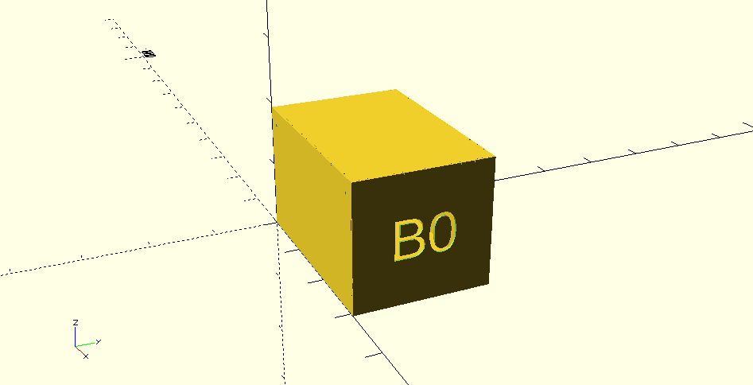
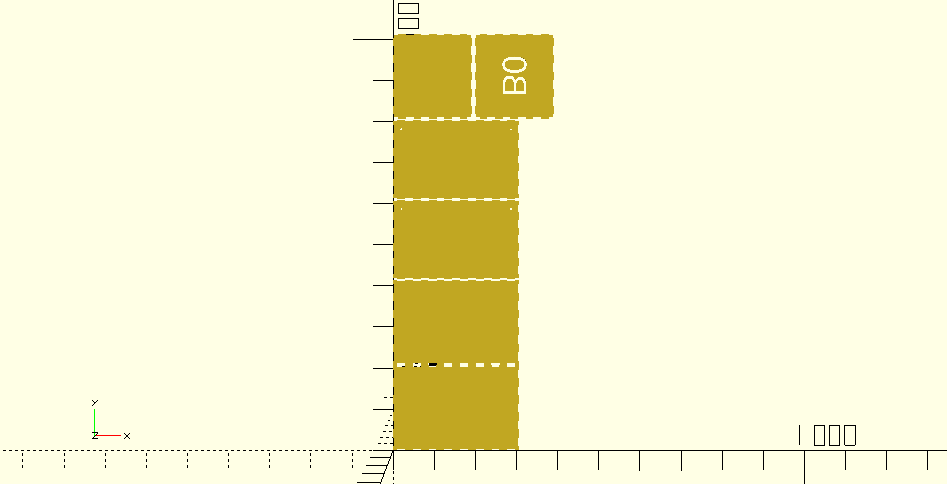

# Laser Cutter Templates

My OpenSCAD laser cutting templates and utilities repo.

## OpenSCAD Project Box Generator - box.scad

A quick OpenSCAD script to generate open or closed boxes of any size with optional
engravings on the front. The closed box features a lid with looser fit for easy
removal. Includes holes for Neodymium magnets to allow modular *arrays* of
boxes to connect together.

### Usage

Open 'box.scad' and set parameters prior to **SETTINGS END** header. Comments
should explain what each parameter does. To preview leave `export = false`.
Once ready to laser-cut, change `export = true`.

See example DXF exports within the 'box-examples/' folder.

### Preview

### Export

---

# License

GPL-3.0 - [JBR Engineering Research Ltd](http://www.jbrengineering.co.uk) 2016

